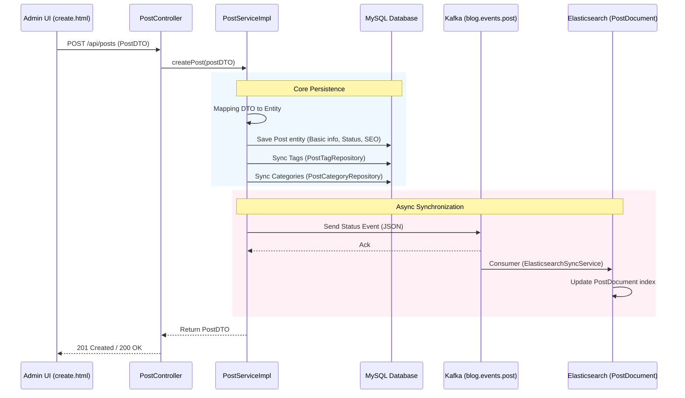
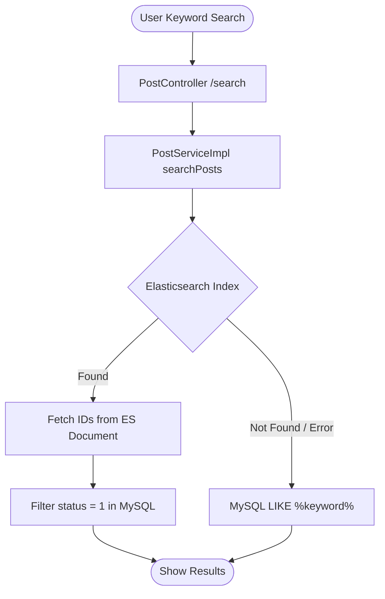

# Post Management Lifecycle & Data Flow

This document describes the technical flow of a Blog Post, from creation in the Admin Dashboard to its persistence in the database and synchronization with Elasticsearch for high-performance searching.

## 1. Creation & Update Flow

The process of saving a post involves multiple layers to ensure data integrity and real-time search updates.

### Key Components:
- **`PostDTO`**: Decouples the API from the database. It uses ID-based inputs (`tagIds`, `categoryIds`) for creation and returns full objects (`tags`, `categories`) for display.
- **`PostMapper`**: Handles the transformation between DTOs and JPA Entities using MapStruct.
- **`PostServiceImpl`**: Orchestrates the logic, including:
    - Generating slugs from titles.
    - Handling status-based publishing dates.
    - Managing many-to-many relationships (Tags/Categories).
    - Tracking uploaded files to prevent orphaned assets.

---

## 2. Post Status Workflow

Posts follow a three-state transition model stored in the `status` column of the `post` table.

| Status | Code | Description |
| :--- | :--- | :--- |
| **Draft** | `0` | Default state. Only visible in the Admin Dashboard. |
| **Published** | `1` | Visible to public users on the frontend. `publishedAt` date is set. |
| **Archived** | `2` | Hidden from the public frontend but preserved in the database for reference. |

> [!NOTE]
> Public APIs (like `/api/posts/published` or `/api/posts/search`) only return posts where `status = 1`.

---

## 3. Search Flow (Hybrid Search)

The system uses a "Search Aside" pattern, prioritizing Elasticsearch for speed but falling back to MySQL if necessary.

### Advantages of this flow:
1.  **Speed**: Elasticsearch handles complex text analysis and indexing.
2.  **Reliability**: MySQL serves as the ground truth if the index is out of sync.
3.  **Data Integrity**: Even if ES finds a match, the system verifies the status in MySQL before displaying it to the user.

---

## 4. Featured Image & Asset Tracking

When an image is uploaded as a **Featured Image** or inside the **CKEditor** content:
1.  The file is uploaded to **MinIO** storage.
2.  An entry is created in `upload_tracker` table with `status = UNUSED`.
3.  When the post is saved, `UploadTrackerService` scans the content and the featured image URL.
4.  Matches are marked as `USED`.
5.  A background task periodically deletes `UNUSED` files from MinIO to save space.
