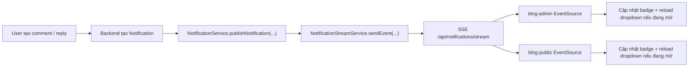

# Mô tả luồng SSE Notification

## Mục tiêu

Tài liệu này mô tả luồng realtime notification đang dùng `Server-Sent Events (SSE)` trong project `blog`, bao gồm:

- Backend stream notification từ `blog-backend`
- Frontend `blog-admin` và `blog-public` subscribe stream
- Cách cập nhật badge unread và danh sách notification
- Các rủi ro vận hành đã gặp
- Khuyến nghị hardening khi tăng số lượng người dùng

Tài liệu này chỉ tập trung vào notification realtime, không mô tả đầy đủ Kafka flow tạo notification.

## Thành phần chính

### Backend

- `blog-backend/src/main/java/me/phuongcm/blog/controller/NotificationController.java`
- `blog-backend/src/main/java/me/phuongcm/blog/service/NotificationStreamService.java`
- `blog-backend/src/main/java/me/phuongcm/blog/service/NotificationService.java`
- `blog-backend/src/main/java/me/phuongcm/blog/security/jwt/AuthTokenFilter.java`

### Frontend blog-admin

- `blog-admin/js/services/notification.service.js`
- `blog-admin/js/ui.js`

### Frontend blog-public

- `blog-public/js/notification.service.js`
- `blog-public/js/ui.js`

## Tổng quan luồng



## Luồng backend

### 1. Client mở stream

Frontend gọi:

- `GET /api/notifications/stream`

Endpoint nằm tại:

- `NotificationController.streamMyNotifications()`

Controller trả về:

- `SseEmitter`

Ngay khi subscribe, backend gọi:

- `NotificationStreamService.subscribe(userId)`

Trong `subscribe(userId)`:

1. Tạo `SseEmitter`
2. Lưu emitter vào `emittersByUser`
3. Gắn callback `onCompletion`, `onTimeout`, `onError`
4. Gửi snapshot đầu tiên gồm `unreadCount`

### 2. Xác thực stream

SSE không dễ gửi header `Authorization` như `fetch`, nên frontend đính token vào query string:

- `/api/notifications/stream?token=...`

`AuthTokenFilter` có logic đặc biệt:

- Nếu request là `/api/notifications/stream`
- Thì đọc `token` từ query parameter
- Validate JWT
- Đẩy user vào `SecurityContext`

### 3. Gửi event đầu tiên

Ngay sau khi subscribe thành công, backend gửi event:

- event name: `notification`
- payload: `NotificationStreamEvent("INIT", unreadCount, null)`

Mục đích:

- client có unread count ngay
- không cần chờ notification mới hoặc polling đầu tiên

### 4. Gửi notification mới

Khi hệ thống tạo ra một `Notification` mới:

1. `NotificationService` lưu record vào database
2. Gọi `notificationStreamService.publishNotification(savedNotification)`
3. `publishNotification(...)` tính lại `unreadCount`
4. Gọi `sendEvent(userId, payload)`
5. Gửi payload tới toàn bộ emitter còn sống của user đó

Payload hiện tại chứa:

- `type`
- `unreadCount`
- `notification`

### 5. Đồng bộ unread count khi đọc notification

Khi client gọi:

- `PUT /api/notifications/{id}/read`
- `PUT /api/notifications/read-all`

Backend không chỉ update DB mà còn gọi:

- `notificationStreamService.publishUnreadCount(userId)`

Việc này đảm bảo các tab khác cùng user được cập nhật badge ngay.

### 6. Heartbeat

`NotificationStreamService` có job:

- `@Scheduled(fixedDelay = 25000)`

Nó gửi:

- event name: `heartbeat`
- data: `"ping"`

Mục đích:

- giữ connection sống
- phát hiện emitter hỏng
- dọn emitter stale

## Luồng frontend

## blog-admin

File chính:

- `blog-admin/js/services/notification.service.js`

Luồng:

1. `AdminNotif.init()` được gọi khi page admin khởi tạo
2. `refreshBadge()` tải unread count ban đầu
3. `startRealtime()` mở `EventSource`
4. Nghe event `notification`
5. Parse JSON payload
6. Gọi `applyUnreadCount(...)`
7. Nếu dropdown đang mở thì `loadList()`

Ngoài ra:

- Khi tab bị ẩn: đóng realtime
- Khi tab hiện lại: mở lại realtime
- Khi `pagehide` hoặc `beforeunload`: đóng realtime
- Nếu SSE lỗi: fallback sang polling `60s`

## blog-public

File chính:

- `blog-public/js/ui.js`
- `blog-public/js/notification.service.js`

Luồng tương tự admin:

1. `UI.renderNav()` dựng notification bell
2. `_refreshNotifBadge()` tải unread ban đầu
3. `_startNotifRealtime()` mở `EventSource`
4. Nghe event `notification`
5. `_applyNotifBadge(...)`
6. Nếu dropdown mở thì `_loadNotifications()`

Ngoài ra:

- Có lifecycle guard để tránh mở nhiều stream song song
- Đóng stream khi tab ẩn hoặc rời trang
- Fallback sang polling nếu SSE hỏng

## Cấu trúc dữ liệu realtime

Backend gửi object kiểu `NotificationStreamEvent`.

Các trường quan trọng:

- `type`
  - `INIT`
  - `SYNC`
  - `NEW_NOTIFICATION`
- `unreadCount`
- `notification`

Client hiện tại chủ yếu dùng:

- `payload.unreadCount`

Nghĩa là dù event là `INIT`, `SYNC` hay `NEW_NOTIFICATION`, frontend đều chỉ cần cập nhật badge trước. Nếu dropdown đang mở thì frontend gọi REST API để lấy list mới nhất.

## Vì sao frontend vẫn dùng REST để tải danh sách notification

SSE hiện chỉ đóng vai trò:

- báo có thay đổi
- đồng bộ unread count

Danh sách notification đầy đủ vẫn được tải bằng:

- `GET /api/notifications?page=...&size=...`

Lý do:

- tránh đẩy logic render danh sách phức tạp hoàn toàn qua SSE
- giữ client đơn giản hơn
- khi dropdown mở, luôn lấy dữ liệu mới nhất từ DB

## Vấn đề đã gặp

### 1. Browser bị `Stalled`, API khác treo

Hiện tượng từng gặp:

- `/api/categories`
- `/api/posts/...`
- các request REST khác bị `Stalled`

Nguyên nhân chính:

- SSE là kết nối giữ lâu
- browser giới hạn số connection đồng thời trên cùng origin
- nếu mở nhiều `EventSource` mà không đóng đúng cách, các API thường phải xếp hàng chờ

Đây là nguyên nhân thường gặp hơn nhiều so với deadlock backend.

### 2. Nhiều emitter tích lũy cho cùng một user

Nếu client reconnect hoặc mở nhiều tab:

- cùng user có thể có nhiều emitter trong `emittersByUser`
- số connection mở tăng nhanh
- khó cleanup nếu lifecycle không chặt

### 3. Timeout vô hạn

Trước đây `SSE_TIMEOUT_MS = 0L` nghĩa là timeout vô hạn.

Rủi ro:

- emitter cũ có thể sống quá lâu
- stale connection không bị dọn nhanh
- browser và backend đều giữ tài nguyên không cần thiết

## Các biện pháp đã thêm

### Frontend

- Không mở stream mới nếu stream hiện tại còn sống và cùng URL
- Đóng stream khi:
  - `document.visibilityState === 'hidden'`
  - `pagehide`
  - `beforeunload`
- Chỉ mở lại khi tab quay lại foreground
- Fallback polling khi SSE lỗi

### Backend

Trong `NotificationStreamService`:

- `SSE_TIMEOUT_MS = 120_000L`
- `MAX_EMITTERS_PER_USER = 2`
- Nếu user reconnect vượt ngưỡng thì backend chủ động `complete()` emitter cũ
- Heartbeat `25s` để phát hiện emitter hỏng

## Trade-off của cấu hình hiện tại

### Ưu điểm

- Đơn giản hơn WebSocket
- Chỉ cần server push một chiều
- Phù hợp bài toán notification badge
- Dễ kết hợp với REST list API

### Nhược điểm

- Browser giới hạn số long-lived connections theo origin
- Nhiều tab cùng lúc dễ chạm trần connection hơn WebSocket shared approach
- Không phù hợp nếu sau này cần realtime 2 chiều

## Với 100 user có ổn không

Về mặt kiến trúc:

- `100` user mở `1` tab/user là hoàn toàn khả thi với SSE

Nhưng chỉ ổn khi:

- mỗi user giữ ít stream
- cleanup emitter tốt
- backend không scale ngang kiểu nhiều instance mà thiếu fan-out

Nếu mỗi user mở nhiều tab:

- số connections tăng rất nhanh
- nguy cơ nghẽn ở browser, proxy hoặc backend tăng mạnh

## Khuyến nghị hardening tiếp theo

### Mức nên làm ngay

- Giảm `MAX_EMITTERS_PER_USER` từ `2` xuống `1` nếu business không cần nhiều tab cùng user
- Thêm log subscribe / complete / timeout / error theo `userId`
- Thêm metric đếm emitter active

### Mức production tốt hơn

- Thêm endpoint debug nội bộ để xem số emitter đang active
- Dùng Redis pub/sub hoặc Kafka nếu deploy nhiều instance backend
- Nếu cần nhiều realtime feature hơn notification, cân nhắc WebSocket

## Debug checklist

Khi nghi SSE làm treo API, kiểm tra theo thứ tự:

1. Network tab lọc `notifications/stream`
2. Mỗi tab chỉ nên có tối đa `1` SSE request sống
3. Dùng PowerShell kiểm tra connection:

```powershell
Get-NetTCPConnection -LocalPort 8055 | Select-Object LocalAddress,LocalPort,RemoteAddress,RemotePort,State,OwningProcess
```

4. Nếu thấy quá nhiều `Established` tới `8055`, nghi ngờ connection leak phía client hoặc emitter leak phía backend
5. Kiểm tra log subscribe / timeout / error của backend
6. Nếu vẫn treo dù connection ít, lấy thread dump Java để phân biệt:
   - kẹt ở Tomcat
   - kẹt ở DB pool
   - kẹt ở security filter

## Kết luận

Luồng SSE hiện tại phù hợp cho notification realtime một chiều nếu được kiểm soát chặt vòng đời kết nối.

Điểm quan trọng nhất rút ra từ đợt lỗi này:

- Không để client mở nhiều `EventSource` tới cùng origin mà không cleanup
- Không để backend giữ emitter vô hạn
- Luôn coi browser connection limit là ràng buộc thực tế khi dùng SSE

SSE không tự động “chống tải” cho số lượng user lớn. Nó chỉ ổn khi:

- lifecycle đúng
- cleanup đúng
- connection được giới hạn
- backend có khả năng fan-out phù hợp với mô hình triển khai
